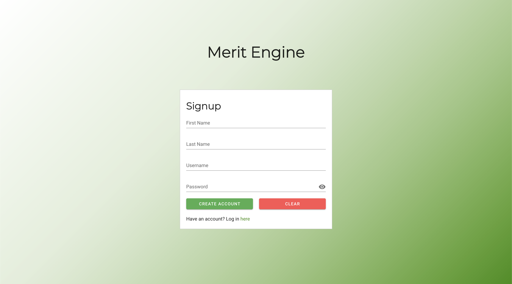
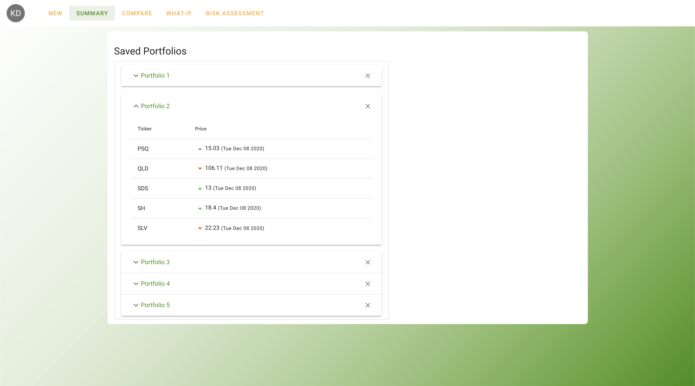
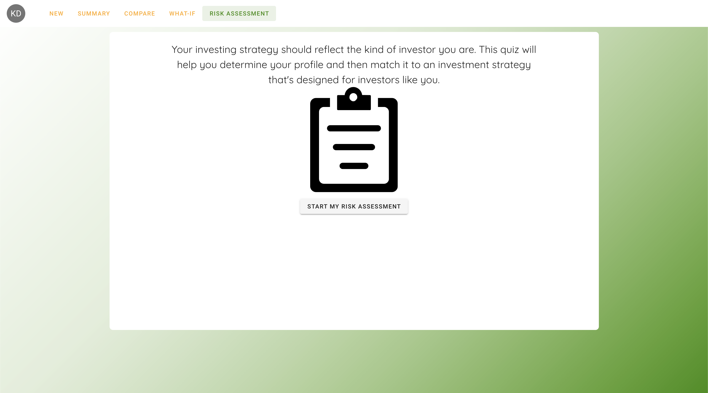
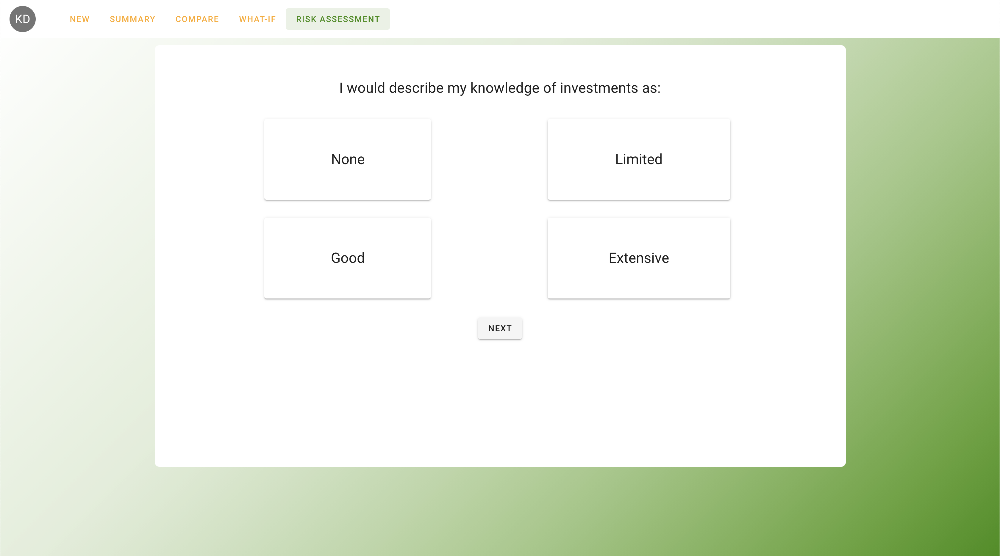

# Merit Engine
---

- Description: A financial advising tool and API for financial advisors that generates and displays potential portfolios to their clients. The project is fully connected to a database that stores all client and advisor information and accounts. The goal of the project is for advisors to be able to calculate optimal portfolios by taking in the parameters: risk tolerance, desired rate of return, and desired length of term.

- Features:
    - Generate optimal portfolios curated to any individual investor's needs
    - Ability to take risk assessments to calculate an investors risk tolerance
    - Ability to compare up to 5 portfolios at a time
    - Ability to create accounts and login
    - View expanded details about portfolios that you have generated

- Technologies used: ASP.Net, C#, Vue.js, Node, HTML5, CSS, JavaScript, Ajax, Docker, MongoDB

- Team methodologies used: Agile and Scrum iterative sprint development model, UML charts for project design, Test Driven Development implementation

- Source Code: This is a closed source project

{: .project-image}

{: .project-image}

{: .project-image}

{: .project-image}

{: .project-image}

{: .project-image}

{: .project-image}