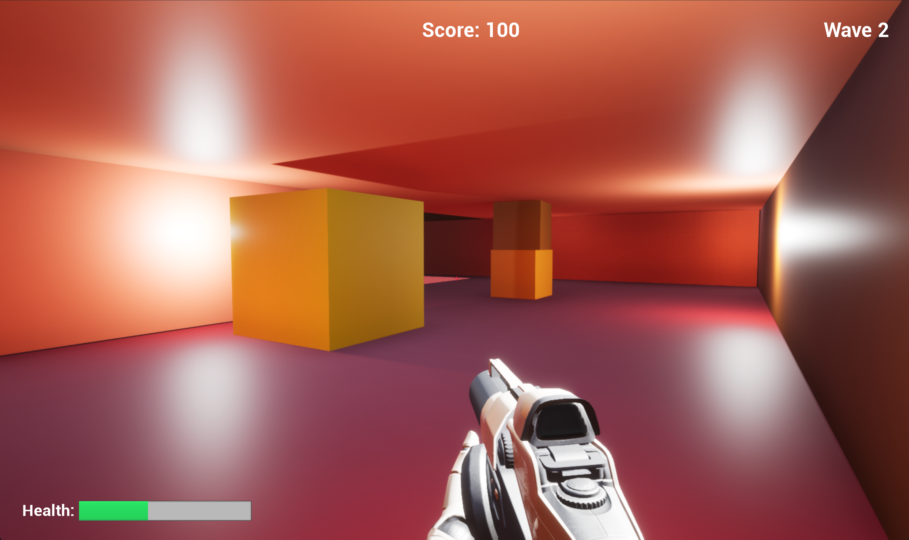
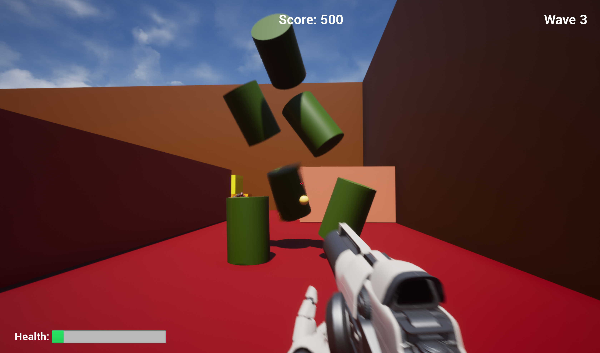
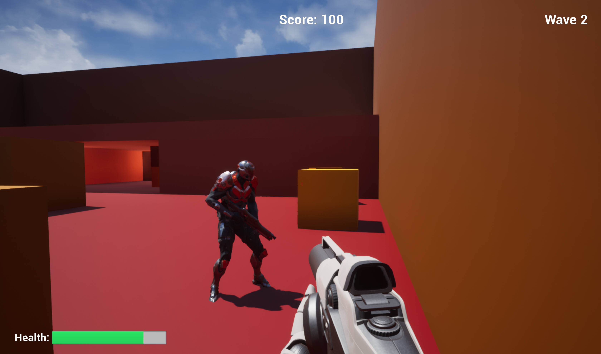
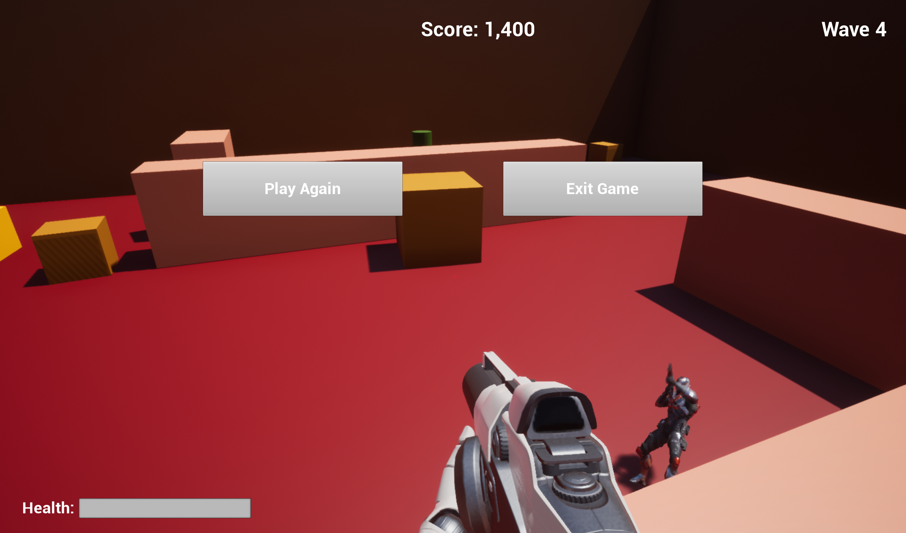

# WavesFPS
---

[Check out the source code](https://github.com/evanknapke/WavesFPS)

## Description

A 3D 3rd person shooting game that gets increasingly more difficult as the game goes on.

## Gameplay

- Player is met by an increasing number of enemies.
- Enemies have guns and shoot at the player. 
- Player must navigate the level and shoot the enemies in order to beat the round.
- When round is over the next wave will start with more enemies.
- The game lasts until the player dies.

## Authors

- Evan Knapke

## Acknowledgments

- Dr. Paul Gestwicki for guidance and answering questions that I had
- Nick Hammerstrom for assisting with the world design

## Technologies

- Unreal Engine 4

## Music

Background music is from [www.dl-sounds.com](https://www.dl-sounds.com/royalty-free/power-bots-loop/), titled "Power Bots Loop".
		Used under [dl-sounds license](https://www.dl-sounds.com/license/) which states that their music does not require any acknowledgements.

## Grade Earned and Grading Criteria/Requirements

- [x] D-1: Use standard mouse+keyboard or gamepad controls for your chosen view.
- [x] D-2: Include terrain or obstacles that the player can climb up onto or jump over.
- [x] D-3: Correctly configured on the depot so that a new client provides a runnable game.
- [x] C-1: Include a trigger volume that creates a meaningful in-game effect.
- [x] C-2: Include one or more additional characters with which the player 
          can meaningfully interact.
- [x] C-3: Include looping music and one or more sound effects.
- [x] C-4: Start with a title screen that can transition into gameplay.
- [x] C-5: Create a heads-up display (HUD) that tracks in-game statistics such as 
          health, time, or score.
- [x] C-6: Runs without errors
- [x] C-7: All raw referenced assets are in the <code>ToImport</code> folder.
- [x] C-8: Demonstrated during the associated showcase day.
- [x] C-9: Complies with an <a href="http://www.esrb.org/ratings/">ESRB rating</a> of &ldquo;M&rdquo; or lower.
- [x] C-10: All assets are in a folder named after the project [GUSG&nbsp;<a href="https://github.com/Allar/ue4-style-guide#structure-top-level">2.2</a>].
- [x] C-11: Project report meets the requirements listed on <a href="https://www.cs.bsu.edu/~pvgestwicki/courses/cs315Fa19/project">the projects page</a>.
- [x] B-1: Allow the player to start again after the game is over.
- [x] B-2: Include an AI-controlled character that can detect the player and react to it (for example, by chasing it or firing at it).
- [x] B-3: Compiles without warnings.
- [x] B-4: Assets and directories follow naming conventions [GUSG&nbsp;<a href="https://github.com/Allar/ue4-style-guide#anc">1</a>, <a href="https://github.com/Allar/ue4-style-guide#21-folder-names-">2.1</a>].
- [x] B-5: Variables and methods follow naming conventions [GUSG&nbsp;<a href="https://github.com/Allar/ue4-style-guide#321-naming-">3.2.1</a>, <a href="https://github.com/Allar/ue4-style-guide#321-naming-">3.3.1</a>].
- [x] B-6: Contains no assets not used in the build.
- [x] B-7: Commit messages follow established standards.
- [x] B-8: Uses timers and tasks appropriately rather than abusing the <code>Tick</code> event.
- [x] A-1: Meaningfully incorporate one or more character animations beyond the default
          movement animations.
- [x] A-2: Complies with an <a href="http://www.esrb.org/ratings/">ESRB rating</a> of &ldquo;T&rdquo; or lower.

## Screenshots

{: .project-image}

{: .project-image}

{: .project-image}

{: .project-image}

{: .project-image}